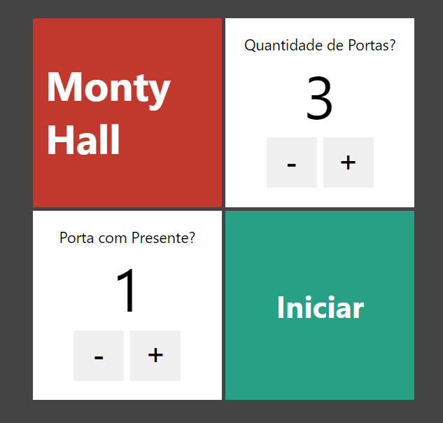

# Porta Premiada

Trata-se de um jogo onde há uma porta que possui um presente, e o usuário deve tentar achar a devida porta

Projeto baseado em [Next.js](https://nextjs.org/) criado a partir do comando [`create-next-app`](https://github.com/vercel/next.js/tree/canary/packages/create-next-app).

## Iniciar o projeto

Para iniciar em modo de desenvolvimento:

```bash
npm run dev
# or
yarn dev
# or
pnpm dev
```

Abra [http://localhost:3000](http://localhost:3000) e no seu browser exibirá o resultado.

## Resumo do Jogo

Um usuário(apresentador) deve selecionar a quantidade de portas que terá no jogo, e qual será a porta que possuirá o presente, assim iniciando o jogo. Um segundo usuário tentará adivinhar qual a porta que está com o presente, se o mesmo acertar ganha o jogo.

<p align="center">
  
</p>
